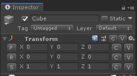

在其他DLL工程要访问 TransformInspector2 的剪贴板对象

```csharp
    private static Assembly sFacebook;
    private static FieldInfo sFacebookClip;

    private Vector3 ShowCopyPaste(Vector3 vector3Value)
    {
        if (sFacebook == null)
        {
            sFacebook = ArrayUtility.Find(AppDomain.CurrentDomain.GetAssemblies(), a => a.GetName().Name == "UnityEditor.Facebook.Extensions");
            var type = sFacebook.GetType("UnityEditor.TransformInspector2", false, false);
            if (type != null)
            {
                FieldInfo fieldInfo = type.GetField("s_ClipBoardVector3", BindingFlags.Static | BindingFlags.NonPublic);
                if (fieldInfo != null)
                {
                    sFacebookClip = fieldInfo;
                }
            }
        }

        bool reset = GUILayout.Button(copyContent, GUILayout.Width(21f));
        if (reset)
        {
            if (sFacebookClip != null)
            {
                sFacebookClip.SetValue(null, vector3Value);
            }
        }
        reset = GUILayout.Button(pasteContent, GUILayout.Width(20f));
        if (reset)
        {
            if (sFacebookClip != null)
            {
                return sFacebookClip.GetValue(null) is Vector3 ? (Vector3) sFacebookClip.GetValue(null) : vector3Value;
            }
        }

        return vector3Value;
    }
```